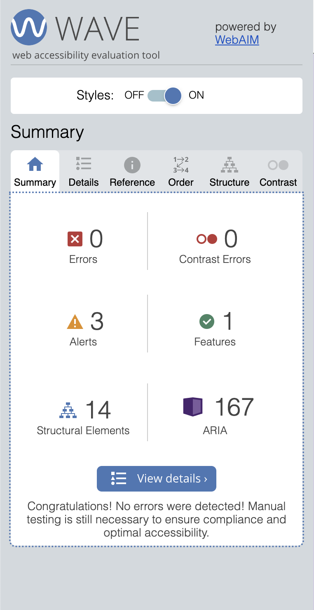
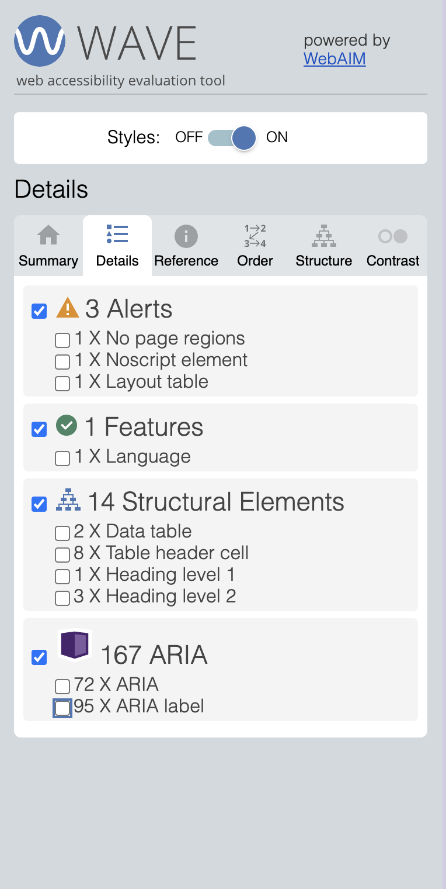
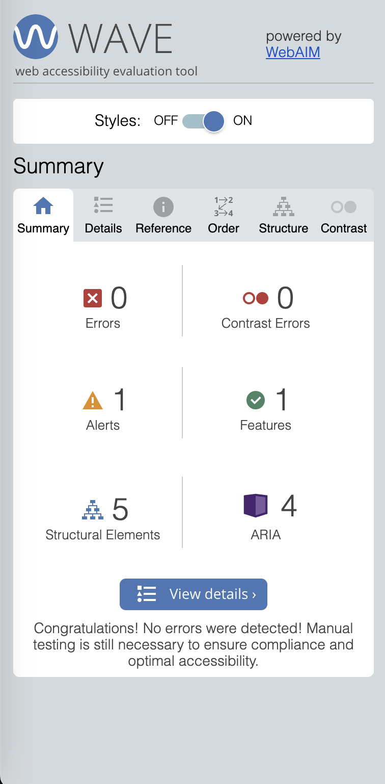
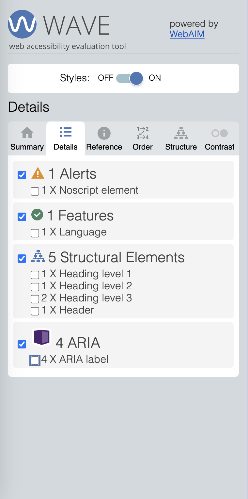
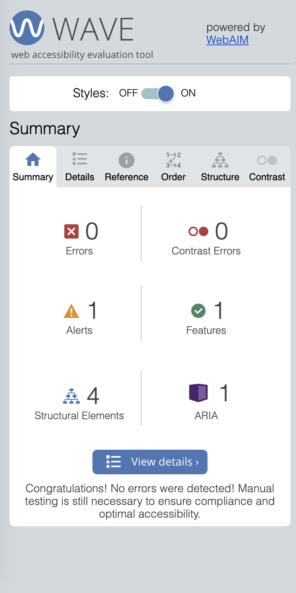
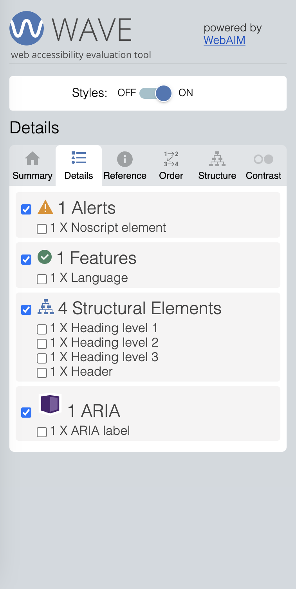

# **FP4 \- Final Project Writeup**

## Part 1: Website Description

My final project is a self-reflection website called Self-Reflection into the Void that gives users the option to self-reflect through the process of journaling without having the need to store those journaling sessions. Giving users the option to not store their self-reflection sessions can give them the peace of mind knowing that their personal information and issues will not be stored. However, for each day a self-reflection session is created, there will be a purple heart icon displayed on the monthly calendar on the home page regardless of whether or not the user decides to store their journal entry. Keeping track of the days of self-reflection can help users keep track of their self-care process. The motivation behind this idea is to encourage people to take care of their mental health through self-reflection and the documentation of their self-growth journey.

What makes the app engaging is the concept of giving the users as much control over their self-reflection process as possible. Each time the user decides to make the decision of saving or not saving a self-reflection entry, pop-ups will appear on the web page that asks the user whether or not they would like to stick to their decision. There is also the option of letting users remove specific entries that they decided to save in the past if they don’t feel comfortable with seeing any specific entries they have previously written. The target audience of this app is anyone who is invested in their mental health or anyone who would like to start their mental health journey. The target audience also consists of people who care about personal data privacy.

A future iteration of this app would include the process of submitting an audio recording as a self-reflection session as well as account settings. 

## Part 2: User Interaction

Here is a list of all the user interactions on my website:
* Accessing the Kept Sessions page (where all the saved entries are stored)
    * Click on the “Your Kept Sessions” button and get redirected to the kept sessions page.
    * Click on the delete button for any of the entries that have been previously saved (need to submit a journal entry if there are no previously saved entries shown).
        * A pop-up appears that asks the user if they are sure they would like to remove the journal entry. User either clicks “yes” button or “no” button
            * Clicking on “yes” removes entry from the list of kept entries and redirect user to the home page (can then click back on “Your Kept Sessions” button on the home page to see that journal entry was removed)
            * Clicking on “no” makes popup disappear
    * Click on “Take me back home” button to be redirected back to the home page
* Creating a journaling entry for a self-reflection session
    * Click on “Journal” button on the home page
        * If user has already created a journal entry for current day, a pop-up will appear that says that user should come back and journal another day since an entry has already been created (for testing purposes: if you’ve already created a journal entry for today and you still want access to the journaling page, you would have to delete whatever is in local storage so that you can get access to the journal page again when clicking on this button → this will unfortunately delete whatever you’ve written previously for the current day)
            * (To remove whatever is in local storage, inspect the page, click on the Application tab, click on the clear all icon under local storage, and then reload the page → if you see three elements in local storage after reloading, they are meant to be there; they exist for demonstration purposes to show the heart icons on the monthly calendar)
        * If user has not created a journal entry yet, they will be redirected to the journal page
            * Click on text area box and type whatever you are feeling in it
            * Scroll down the page and either click on “yes” or “no” buttons to save or not save the journal entry
                * Clicking on “yes” button makes pop-up appear that asks if the user is sure that they would like to save their entry with an additional set of “yes” or “no” buttons
                    * Clicking on “yes” saves entry and redirects user to the home page
                    * Clicking on “no” doesn’t save entry and makes the popup disappear
                * Clicking on “no” button makes pop-up appear that asks if the user is sure that they would not like to save their entry with an additional set of “yes” or “no” buttons
                    * Clicking on “yes” makes the decision to not save entry but will still display heart icon on monthly calendar for that day; user also gets redirected to the home page
                    * Clicking on “no” doesn’t make the decision to not save the entry and makes the popup disappear
            * Click on “Take me back home” button to be redirected back to the home page
                * Another set of “yes” or “no” buttons appear to make sure that user wants to actually be redirected to the home page
* Interacting with the Monthly Calendar
    * Click on the right arrow button at the top right of the calendar to show the monthly calendar for the upcoming month
    * Click on the left arrow button at the top right of the calendar to show the monthly calendar for the previous month
    * Click on “today” button to get redirected back to current month on the calendar

## Part 3: External Tool

1. Full Calendar 
   * Full Calendar is a React component library built on top of Full Calendar’s core Javascript library that allowed me to integrate a monthly calendar onto my home page.
   * I chose to use it since I thought it would be more efficient to use a calendar that has already been created instead of creating one on my own.
   * I used it by importing the library and calling the Full Calendar component on my calendar.js file. I already knew that Full Calendar existed, but never successfully used it before, so I decided to use this library instead of another one.

2. Google Fonts
   * I used Google Fonts so that I can get access to a font called Lexend, which is the font I used for the entirety of my website.
   * I used Google Fonts since I thought it was an easy way to incorporate the font that I wanted to use for my website.
   * I got access to the font by adding a few link elements to my index.html file and using Lexend as the font-family value for my CSS files.

## Part 4: Design Iteration

After creating the Figma prototypes for my FP2 submission, I transitioned into coding out my website. I decided that I needed to scale down due to the time constraints I had to work on this project; I didn’t implement one of my initial core functionalities, which was to let users submit an audio recording as a self-reflection session. I also wanted to create an account setup for my website, but I probably can create the setup for a future iteration of my website as well as the audio recording option. Additionally, my website doesn’t fully align with all the visuals of my Figma prototypes, but it’s very similar.

## Part 5: Implementation Challenge

One challenge I had to deal with was displaying the purple heart icons in the monthly calendar. Since I didn’t code out the monthly calendar myself, I needed extra help in understanding Full Calendar’s code. I used ChatGPT to understand how to add the icons while using the Full Calendar library. Another challenge I dealt with was redirecting the user back to the homepage after interacting or seeing a pop-up; I eventually used React Router’s Link component due to ChatGPT’s recommendation.

## Part 6: Generative AI Use and Reflection

### Usage Experiences by Project Aspects

| Tool Name | Ratings | design | plan | write code | debug |
| :---- | :---- | :---- | :---- | :---- | :---- |
| ChatGPT | Usage | No | No | Yes | Yes |
| ChatGPT | Productivity | ~ | ~ | 5 | 5 |

### Usage Reflection

I used ChatGPT whenever I needed suggestions on how to fix any difficult bugs I found in my code. Additionally, I used it to understand how to use the Full Calendar library properly, especially when I was trying to add the purple heart icons in the monthly calendar. The majority of my code was authored by me, but I used ChatGPT’s code specifically to display the purple heart icons, which is in calendar.js in the renderDayCell function. I also took some recommendations that ChatGPT had and integrated smaller parts of generated code into my own code. For example, when I was having issues redirecting the user back to another page after showing them a few of the pop-ups, I used ChatGPT to give me recommendations on how to fix the problem. Eventually, I used React Router’s Link component due to ChatGPT’s recommendation. 
 
Whenever ChatGPT had any coding recommendations regarding how to resolve an issue, I would first give it a try to see if it successfully helped. If it didn’t, then I would ask it more follow-up questions. If the follow-up questions didn’t help, I would find some other way to solve the issue on my own or with other recommendations I found online. 

A good number of the GenAI responses that ChatGPT came up with didn’t give me the solutions that would work well with my code, so I had to ask follow-up questions to get better responses that eventually gave me a solution that worked. I think it made the process of creating my project easier only when I asked it enough follow-up questions for it to come up with better suggestions for my coding issues. One of the biggest insights I found when using ChatGPT was that it’s only helpful if you have the patience to go through the process of repeatedly reading its responses and asking follow-up questions until you get a response that you are satisfied with. 

My usage of ChatGPT aligned with my plan and expectations from FP 2. However, I didn’t ask ChatGPT to list out other components or libraries I can incorporate into my code like I thought I would in FP2.

### Usage Log

1. [Chat history about how to redirect user to another page after pop-up appears](https://chatgpt.com/share/675a4e38-1c70-8006-a951-449124123477)
2. [Chat history about how to add icon to monthly calendar](https://chatgpt.com/share/675a4ee8-f840-8006-9534-5628c8c71022)
3. [Chat history about CSS styling](https://chatgpt.com/share/675a4feb-0940-8006-bf30-dee229a2cda0)
4. [Chat history about CSS styling, specifically for pop-ups:](https://chatgpt.com/share/675a505a-b008-8006-9fc4-2dfd12e7ba18)
5. [Chat history about pages that aren’t the homepage of the website not showing up when reloading the page after deployment](https://chatgpt.com/share/675a5146-64f0-8006-b225-914c77678ae1)

## Responsiveness
Please test out website using these two dimensions (add these dimensions when inspecting website and make dimensions responsive):
* Dimensions of an iPad mini 8.3: 744 x 1133
* Dimensions of a Desktop: 1440 x 1024

## Accessibility

Screenshots for Home Page:

Screenshots for Journal Page:

Screenshots for Kept Sessions Page:

---

# **FP2 \- Evaluation of the Final project**

## Project Description

The basic idea of this project is to give users the option to self-reflect through the process of journaling or audio recordings without having the need to store those journaling or audio recording sessions. Giving users the option to not store their self-reflection sessions can give them the peace of mind knowing that their personal information and issues will not be stored. However, for each self-reflection session, there will be a mark on the monthly calendar shown on the web app that represents that specific self-reflection session regardless of whether or not the user decides to store their journal entry or audio recording. Keeping track of the days of self reflection can help users keep track of their self-care process. The motivation behind this idea is to encourage people to take care of their mental health through self-reflection and the documentation of their self-growth journey.

## High-Fi Prototypes

### *Prototype 1*

**Initial Prototype Before Receiving User Feedback**

Link to initial prototype before receiving user feedback: 
https://www.figma.com/proto/3UEIE9SsbUbclSC41r37WB/PUI-FP2?node-id=15-17&node-type=canvas&t=vufWZL0Mb4qj9a45-1&scaling=min-zoom&content-scaling=fixed&page-id=0%3A1&starting-point-node-id=15%3A17&hotspot-hints=0

Video Clip for interactions of initial prototype:
https://drive.google.com/file/d/1qQA0KgOpLNNh_xPEyaKF5UZFbraNx-yM/view?usp=sharing

Brief Summary of User Feedback:

I decided to create one high-fi prototype that consists of the majority of the core features of my web app instead of creating two separate prototypes that each focus on one separate core feature. My high-fi prototype consists of these core features: creating a journal entry, creating an audio recording, and accessing the kept sessions page.

Based on user feedback, one concern was the confusion regarding the “let it go” button and the “changed your mind?” button that appear on the page where a user can create a journal entry and the page where a user can create an audio recording. There was also concern regarding the lack of specific functions that help users to create audio recordings. Another area of concern was the process of listening to a previous audio recording on the page where you can access previously kept self-reflection sessions.

**Updated Prototype After Receiving User Feedback:**

Link to updated prototype after receiving user feedback:
https://www.figma.com/proto/3UEIE9SsbUbclSC41r37WB/PUI-FP2?node-id=82-79&node-type=canvas&t=flW8typCMxO8WeZM-0&scaling=min-zoom&content-scaling=fixed&page-id=0%3A1&starting-point-node-id=82%3A79&hotspot-hints=0

Video Clip for interactions of updated prototype:
https://drive.google.com/file/d/1IOY1NWn25eXo-h5EuaivtNEdfxcd6UfP/view?usp=sharing

## Usability Test

**Here are the four tasks that I asked my participants to do during the usability testing sessions:**

Task #1: Please try to create a journal entry and to save that entry to the website.

Task #2: Please try to create an audio recording that you don’t want to save to the website.

Task #3: Try to start another audio recording, but imagine that you decide to not continue with working on the session.

Task #4: Please try to access and remove the audio recording that you created on October 15th.

**Here are some follow-up questions I asked the participants:**

Is there anything that you found odd about the website?

How do you like the visuals of this website?

Do you feel any sense of calm when working with this website?

**Here is the overall feedback I got from both participants regarding the four tasks and the follow-up questions:**

The first participant had the most concern regarding the “let it go” button on the page where a user can create a journal entry and on the page where a user can create an audio recording. They believed that the wording behind that button didn’t coincide with its function and required more direct wording to hint on what the button is supposed to do, which is to help users complete their journaling session. They also mentioned that the blurred-out background that appears when a user sometimes clicks on buttons throughout the prototype is still showing through too much when there is overlaying text on top of it, which doesn’t make it visually appealing and easily readable. They also mentioned that there needs to be more visual separation between the self-reflection sessions that appear on the page where the kept sessions exist. 

The second participant also believed that the “let it go” button was confusing as well and had a similar suggestion to change the wording of that button. They also didn’t understand the need for that button specifically if the website is already asking the user whether or not they want to save a self-reflection session. They had a similar concern regarding the wording of the “changed your mind?” button on the same page. They were also concerned about the lack of functions that exist when a user creates an audio recording. The initial prototype only has one button with a mic icon on it that lets users record audio, but the participant mentioned that there should be more buttons that can help users stop, continue, or finish their recordings. They also would’ve wanted to see more functions that could help them listen to previous recordings on the Kept Sessions page instead of only depending on one button that only starts and stops the recording. They also didn’t find it necessary to show a display of the journaling entry they just created in pop-up form when they decided to save a journaling entry. They instead suggested giving users access to their saved journal entries or audio recordings by clicking on the heart icons on the monthly calendar. Additionally, they mentioned that the font that was used for the website should be changed to something that is calmer and friendlier since the initial typeface has more of a professional feel to it. 

I went through how I implemented the feedback I got to change my final design below in the Updated Designs section.

## Updated Designs

^ The biggest change I made to the final design was to replace the “let it go” button with a pop-up that appears that asks the user if they are sure that they would like to save or not save their self-reflection session. It’ll help to streamline the process of completing the self-reflection session without needing the user to think about what the “let it go” button is even supposed to do.

^ I also added pop-ups to replace instances where I overlaid text on top of the blurred-out pages to create more of a visual separation between the text and the background.

^ I also added more buttons on the page that helps users to create audio recordings. They help users to pause or continue their recordings whenever they want.

^ I added more visual separation between the sessions shown on the Kept Sessions page of the website by adding a line between sessions. I also added more functions to audio sessions that appear on the Kept Sessions page to let users pause or continue recordings while also letting users drag the progress bar to a specific part of the recording that they would like to hear.

 ^ I decided to completely remove the display of the journal entry that appears whenever the user decides to save a journal entry. However, I might work on letting users access audio sessions or journal entries by clicking on the heart icons on the monthly calendar if I have enough time to work on that function later on.

I also replaced the “changed your mind?” button with a “take me back home” button since I thought it had more direct wording. Finally, I changed the font of the entire website from Merriweather to Lexend to create a more friendly and calm atmosphere to the website.

## Lab Session Feedback Summary

There was a suggestion to create disappear animations to the design of my website, which I tried doing with delayed dissolve animations in my Figma prototype; I would like to mimic those transitions when coding my website. There was also another recommendation to have clearer wording for the functionality of some of my buttons. This is also the same recommendation I got from my users when I did my usability testing sessions. I decided to change the “changed your mind?” button with more direct wording; I changed the text to “take me back home” instead. I also decided to completely delete the “let it go” button since it was too confusing and replaced it with a pop-up instead. Additionally, one student during the lab session mentioned that I should annotate the calendar with different icons related to different phases of a user’s self-growth journey. Even though I think it’s a good idea, I decided to stick with one heart icon to keep the interface simple. Multiple people during the lab session mentioned that letting users create accounts on the website would be helpful, so I am planning on adding that to the design of my website even though I did not add that functionality to my Figma prototype. Multiple people mentioned that adding more animations to the website would be great additions to the website; I did add some dissolve transitions when pop-ups appear on the prototype or when deleting self-reflection sessions from the Kept Sessions page, but I probably won’t add more animations unless I have the time to work on them later on. 

## Milestones

### *Implementation Plan*

- [ ] Week 9 Oct 28 \- Nov 1:
  - [X] FP1 due
  
- [ ] Week 10 Nov 4 \- Nov 8:   
  - [X] FP2 due
  - [ ] Work on the home/main page of the website, which includes the buttons, the calendar, and the rest of the interface of the page
  - [ ] Work on the sign-in and sign up pages and the account settings page for the website

- [ ] Week 11 Nov 11 \- Nov 15:
  - [ ] Finish up whatever I need to work on for the home page, the sign-up page, the sign-in page, and the account settings page
  - [ ] Start working on the interactions and the interface of the journaling page and the audio recording page
  - [ ] Work on linking those two pages to the main page

- [ ] Week 12 Nov 18 \- Nov 22:
  - [ ] Figure out how to store the journaling entries and the audio recordings that the user would like to keep
  - [ ] Work on the Kept Sessions page, which includes the visuals and the interactivity

- [ ] Week 13 Nov 25 \- Nov 29:
  - [ ] Deploy the website to Github 
  - [ ] Start working on the write-up for the final project

  - [ ] Thanksgiving

- [ ] Week 14 Dec 2 \- Dec 6:
  - [ ] Continue to work on the write-up for the final project
  - [ ] Submit the project to Gradescope
  - [ ] FP4 due 

### *Libraries and Other Components*

I am planning on using React to code my website. I also plan on using a react calendar component library to add a calendar to the main page of my website, like react-calendar or react-big-calendar. I might also use an API that helps to record audio for when users decide to do an audio recording for their self-reflection sessions, such as the MediaStream Recording API. I might also decide to include other JS libraries or other components as I code the website. 

## Generative AI Use Plan

### *Tool Use*

* ChatGPT  
  * I most likely would use ChatGPT to help me with my implementation of the final project. If I have any issues with the logic of my code, I might ask ChatGPT for any suggestions on how I can fix any bugs that are really difficult for me to figure out on my own. I can imagine myself not being able to find tips or suggestions on Stack Overflow or other articles online that can ultimately help me, so using ChatGPT in those scenarios would be tremendously beneficial.  
  * I also might ask ChatGPT questions regarding how to use new libraries or other components that I have never used before, like the MediaStream Recording API. 
  * I might also even ask about other components or libraries I can use to make the implementation of my website more efficient.
  * I won't use ChatGPT to create massive amounts of code that I can copy and paste, especially if it's code that I don't understand. 

Even though I am most likely going to be using ChatGPT for most of my questions or issues since I have more experience using that AI tool, I wouldn’t be opposed to using other generative AI tools that I haven’t used before if they are better at helping me out with my problems when working on the website, like Gemini or Copilot.

### *Responsible Use*

How would you use Generative AI responsibly?

I would use Generative AI when I need suggestions on how to fix any issues with my code. I won't copy and paste massive amounts of code; I would only use bits of code that I would understand how to use.

---

# **FP1 \- Proposal for Critique**

## Idea Sketches

### *Idea 1*

The basic idea of this final project idea is to create a web app that sends positive affirmations to the user that are related to certain topics that they care about, such as academic stress and career. The motivation behind this idea was to help people improve their feelings of self-worth by exposing them to more positive affirmations; this also encourages them to take care of their mental health. 

To make the app more interactive and engaging, I want to give users the opportunity to choose the specific topic they want positive affirmations for. I also will ask them to choose an option regarding how often they want their positive affirmations to be sent to them (daily, weekly, or monthly). I will also ask them which email address they want the affirmations to be sent to. Additionally, I will give the user the option to ask for a randomly generated affirmation whenever they want one by just clicking on a button. 

To make the design of my website more accessible, I will add plain and readable text throughout the entire website so it’s easier to interpret and understand. I will also add alt text to all of the images that I may add to the website. Additionally, I will make buttons, drop-down, and text fields bigger so that they are more accessible for users.

### *Idea 2*

The basic idea of this project idea is to give users the option to self reflect through the process of journaling or audio recordings without having the need to store those journaling or audio recording sessions. Giving users the option to not store those self-reflection sessions can give them the peace of mind knowing that their personal information and issues will not be stored. However, for each self-reflection session, there will be a mark on the monthly calendar shown on the web app that represents the times when the user did some self-reflection. Keeping track of the days of self reflection can help users keep track of their self-care process. The motivation behind this idea is to encourage people to take care of their mental health through self-reflection and the documentation of their self-growth journey.

To make the app more engaging and interactive, I will ask the user which form of self-reflection they would like to choose, which is either journaling or audio recordings. Once they click on what option they want, they will either write about how they are feeling within a text field or record their session. Once they finish their session, they will have the option to either store or not store that session in the app. I might also decide to add animations to different parts of the web app if I have the time to work on them.

To make the design of my website more accessible, I will add plain and readable text throughout the entire website so it’s easier to interpret and understand. I will also add alt text to all of the images that I may add to the website. Additionally, I will make buttons, drop-down, and text fields bigger so that they are more accessible for users. 

### *Idea 3*

The basic idea of this project idea is to give users the opportunity to send themselves letters in the future. The users also have a “capsule” (collection) of letters that they have already sent to themselves in the past, which they can access whenever they want. The motivation behind this idea is to encourage people to get into the practice of supporting themselves and to self-reflect, which could help them to improve their mental health.

To make the design of this app more engaging and interactive, I will let the user choose which day they would like to send their letter to their future self. I also will give them a text field where they can write up their letter and will let them choose which email address they want to send their letter to. The user can also click on a button called “Capsule” that gives them access to letters they have sent to themselves in the past, which can be thought of as a form of documentation of their self-care journey. 

To make the design of my website more accessible, I will add plain and readable text throughout the entire website so it’s easier to interpret and understand. I will also add alt text to all of the images that I may add to the website. Additionally, I will make buttons, drop-down, and text fields bigger so that they are more accessible for users.

## Feedback Summary

For the Positive Affirmation Generator Idea:

One critique I got was to focus on giving the user specific topics to choose from that they want positive affirmations for instead of letting them add their own topics since more personalization will be difficult to implement. Choosing topics for a specific target audience might be beneficial as well, and having 6-7 topics might be better than the 3 shown on my design sketch. Another critic also mentioned letting users request more topics that could be added later. Another critique I received was to maybe use a dropdown instead of buttons when displaying which topics they want affirmations for. Another idea I got was to add more animations or interactions to how affirmations are showcased to the user in the app. Another critic mentioned to possibly send over the affirmations by text message as well and to perhaps utilize Firebase Cloud Messaging.

For the Self-Reflection Into the Void Idea:

Some people liked the idea of not storing the self-reflection sessions (like the journaling entries or the audio recordings of the sessions) while others thought that sessions could be stored for a short period of time. There was another alternative that was suggested, which was to give users the option to either store certain sessions or to immediately delete them. Another idea was to explicitly show a privacy disclaimer to make users feel more secure about their personal information. Another idea was to create an animation that shows up after deleting a journal entry or audio recording. Another critic mentioned the idea of using local storage to keep track of the journal entries or audio recordings. 

For the Letters to Your Future Self / Letter Capsule Idea:

For this idea, multiple critics mentioned that adding animations and interactions can make the app more engaging and entertaining. Another critic mentioned to maybe send the letters through text message. Another critic thought that implementing persuasive design strategies that implement system 2 thinking might help users reinforce their goals regarding self-reflection.

## Feedback Digestion

For the Positive Affirmation Generator Idea:

I agree with the idea that there should be a few specific topics that the user should choose from. I think it will be much easier for me to create a list of positive affirmations for options that have already been chosen instead of creating lists of affirmations for every single imaginable topic. Additionally, I like the idea of having a dropdown for the different topics to choose from. I also like the idea of showcasing affirmations with the help of animations and/or interactions; however, I will only look into adding animations if I have enough time to work on them. One of the critics also mentioned the idea of sending the affirmations through text instead of email, which I agree with since people might check their text messages more than their emails.

For the Self-Reflection Into the Void Idea:

I understand how users might want the option to store specific journal entries or audio recordings that they want to reference later when they feel like it, so I would like to implement that idea. I’ll dismiss the idea of only temporarily storing those self-reflection sessions for short periods of time since I personally don’t see the benefit of that idea. Another suggestion was to show an obvious privacy disclaimer to the user to make them feel more secure when using the app. I think if the disclaimer mentioned that the app cares about the user’s sense of security and would only help users store the journal entries or recording sessions that they would like to keep, then it will definitely help users feel more at ease and in control of their actions on the app. I also like the idea of storing those chosen self-reflection sessions into local storage. Additionally, I would only think to add more animations if I have time to work on them later. 

For the Letters to Your Future Self / Letter Capsule Idea:

One critic thought that sending letters through text message might be a good idea, but I feel like sending them as a text message might take away from the feeling of receiving a letter from someone. Another idea was to use system 2 thinking to help users reinforce their goals regarding self-reflection, but I will need to think of different ideas to do that, which might take time. I will only work on adding features that use system 2 thinking if I have the time to work on those features. I also think I will put more effort into creating animations if I have more time as well. 

My Chosen Idea for the Final Project:

Based on the critique I got from other students during lab and my process of digesting their feedback, I have decided to go with my Self-Reflection Into the Void idea since I feel like the idea resonated with people the most. I also think it’s a great way for people to self-reflect without feeling the pressure of needing to store personal information about themselves if they don’t want to.
